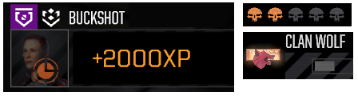

# Clan Earned Fix

Addresses issue where Clan missions with a different difficulty scale gives the game's base XP and CBills.

For example, Battletech Extended CE changes the contract's skull difficulty to start over at half a skull.  However, a half skull Clan mission is considered to be approximately a 3.5 to 5 skull mission.

This mod will give the amount of CBills and XP for clan missions as if it was a regular five skull mission.

Rewards from non clan missions are not affected.

# Requirements
When adding to an existing save, the current planet's current contracts will not be updated.  Moving to a different planet will update the contracts.
# Compatibility
Save to add and remove from existing saves.

May conflict with mods which modify the XP or CBills gained from a contract.

# Suggestions
If you would like a different way to compute the earned XP, please leave a comment.
